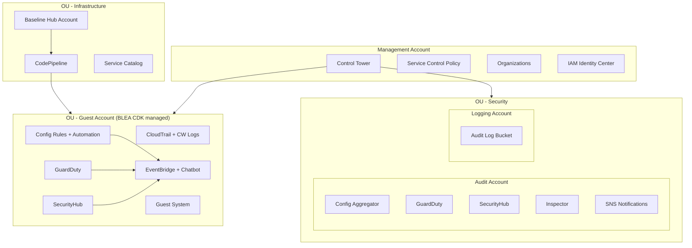
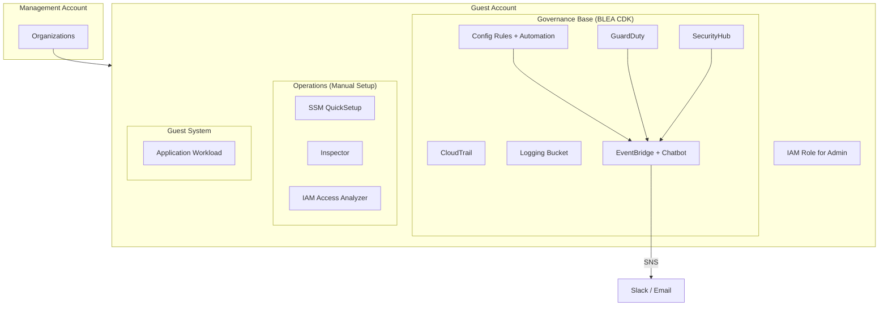

# Baseline Environment on AWS (BLEA)

[](https://github.com/aws-samples/baseline-environment-on-aws/releases)
[](https://github.com/aws-samples/baseline-environment-on-aws/actions?query=workflow%3A"build")

🌐 [日本語で読む / Read in Japanese](README_ja.md)

> Reference AWS CDK templates that establish a secure baseline on standalone or AWS Control Tower multi-account environments. Provides extensible guardrails using AWS security services and end-to-end sample architectures for typical workloads.

## Get Started

| What you want to do | Guide | Time |
| --- | --- | --- |
| Deploy governance baseline (single account) | [HowTo](doc/HowTo.md) | 30 min |
| Deploy governance baseline (multi-account w/ Control Tower) | [Deploy to Control Tower](doc/DeployToControlTower.md) | 60 min |
| Deploy a guest application sample | [HowTo — Guest App](doc/HowTo.md#deploy-a-guest-application-sample) | 15 min |
| Migrate from Standalone to Control Tower | [Migration Guide](doc/Standalone2ControlTower.md) | 45 min |
| Set up CI/CD pipeline deployment | [Pipeline Deployment](doc/PipelineDeployment.md) | 30 min |
| Migrate from v2 to v3 | [v3 Migration Guide](doc/HowToMigrateToV3.md) | 20 min |

## Architecture

BLEA provides two governance models:

- **Multi-Account** (Control Tower) — centralized governance with guardrails across member accounts
- **Standalone** — single-account governance with AWS security services

Both models enable CloudTrail, AWS Config, GuardDuty, Security Hub (FSBP + CIS), default SG remediation, and Health/security event notifications via SNS → Slack/Email.

<details><summary>Multi-Account Architecture (Control Tower)</summary>



</details>

<details><summary>Standalone Architecture (Single Account)</summary>



</details>

See full-resolution diagrams: [Multi-Account](doc/images/BLEA-ArchMultiAccount.png) | [Standalone](doc/images/BLEA-ArchSingleAccount.png) | [Operations](doc/images/BLEA-OpsPatterns.png) | [Stack Dependency](doc/images/BLEA-StackDependency.png)

<details><summary>📂 Governance Baselines & Guest Samples</summary>

### Governance Baselines

| Use Case | Folder |
| --- | --- |
| Standalone governance base | `usecases/blea-gov-base-standalone` |
| Control Tower governance base (guest accounts) | `usecases/blea-gov-base-ct` |

Control Tower governance base offers 3 deployment options:

- Direct deployment (default)
- CDK Pipelines
- Account Factory Customization

### Guest System Samples

| Use Case | Folder |
| --- | --- |
| ECS web application | `usecases/blea-guest-ecs-app-sample` |
| EC2 web application | `usecases/blea-guest-ec2-app-sample` |
| Serverless API application | `usecases/blea-guest-serverless-api-sample` |
| FSx for ONTAP modernization | `usecases/blea-guest-fsxn-modernization-sample` |

> Each use case can be deployed independently.

</details>

<details><summary>⚠️ Constraints & Notes</summary>

| Item | Detail |
| --- | --- |
| Supported CDK version | Uses local `npx aws-cdk` (project-pinned version) |
| Node.js | >= 18.0.0, npm >= 8.1.0 (workspaces) |
| Versioning | Semantic Versioning applies to governance bases only; guest samples may have breaking changes without migration guides |
| Parameters | Managed via `parameter.ts` (TypeScript) per use case since v3.0 |
| Security findings | After deployment, manually remediate CRITICAL/HIGH items reported by Security Hub |

</details>

<details><summary>📚 Related Resources</summary>

- [Changelog](CHANGELOG.md)
- [HowTo Guide](doc/HowTo.md)
- [Deploy to Control Tower](doc/DeployToControlTower.md)
- [Standalone → Control Tower Migration](doc/Standalone2ControlTower.md)
- [Pipeline Deployment](doc/PipelineDeployment.md)
- [v3 Migration Guide](doc/HowToMigrateToV3.md)

</details>

<details><summary>🔧 For Developers</summary>

```sh
git clone https://github.com/aws-samples/baseline-environment-on-aws.git
cd baseline-environment-on-aws
npm ci
```

- [Development workflow](doc/HowTo.md#development-process)
- [Update dependencies](doc/HowTo.md#update-package-dependencies)
- [Contributing](CONTRIBUTING.md)
- [Security issue notifications](CONTRIBUTING.md#security-issue-notifications)

</details>

## License

This library is licensed under the MIT-0 License. See the [LICENSE](LICENSE) file.

---

🌐 [日本語で読む / Read in Japanese](README_ja.md)
