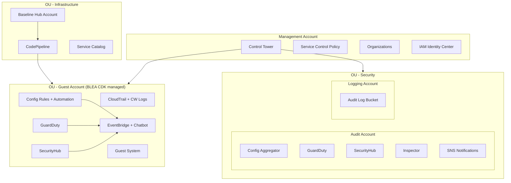
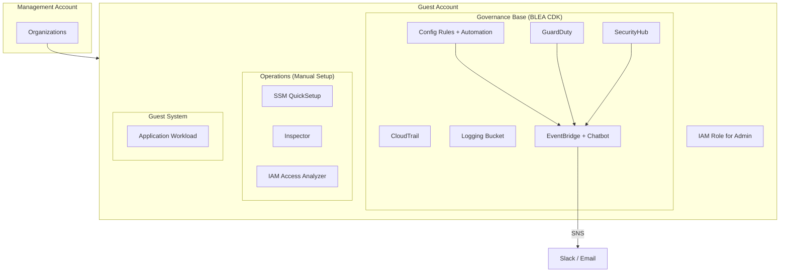

# Baseline Environment on AWS (BLEA)

[](https://github.com/aws-samples/baseline-environment-on-aws/releases)
[](https://github.com/aws-samples/baseline-environment-on-aws/actions?query=workflow%3A"build")

🌐 [Read in English](README.md)

> 単独の AWS アカウントまたは AWS Control Tower で管理されたマルチアカウント環境にセキュアなベースラインを確立するための、リファレンス AWS CDK テンプレート群です。AWS セキュリティサービスによる拡張可能なガードレールと、典型的なワークロード向けのエンドツーエンドサンプルアーキテクチャを提供します。

## はじめる

| やりたいこと | ガイド | 所要時間 |
| --- | --- | --- |
| ガバナンスベースをデプロイ（単一アカウント） | [HowTo](doc/HowTo_ja.md) | 30 分 |
| ガバナンスベースをデプロイ（Control Tower マルチアカウント） | [Control Tower 環境へのデプロイ](doc/DeployToControlTower_ja.md) | 60 分 |
| ゲストアプリケーションサンプルをデプロイ | [HowTo — ゲストアプリ](doc/HowTo_ja.md#ゲストアプリケーションサンプルをデプロイする) | 15 分 |
| Standalone 版からマルチアカウント版へ移行 | [移行ガイド](doc/Standalone2ControlTower_ja.md) | 45 分 |
| CI/CD パイプラインでデプロイ | [パイプラインデプロイ](doc/PipelineDeployment_ja.md) | 30 分 |
| v2 から v3 へ移行 | [v3 マイグレーションガイド](doc/HowToMigrateToV3_ja.md) | 20 分 |

## アーキテクチャ

BLEA は 2 つのガバナンスモデルを提供します:

- **マルチアカウント版**（Control Tower）— メンバーアカウント全体にガードレールを適用する集中管理型
- **Standalone 版** — AWS セキュリティサービスによる単一アカウントガバナンス

両モデルとも CloudTrail、AWS Config、GuardDuty、Security Hub (FSBP + CIS)、デフォルト SG 自動修復、Health/セキュリティイベント通知（SNS → Slack/Email）を有効化します。

<details><summary>マルチアカウント版アーキテクチャ (Control Tower)</summary>



</details>

<details><summary>Standalone 版アーキテクチャ（単一アカウント）</summary>



</details>

高解像度図: [マルチアカウント](doc/images/BLEA-ArchMultiAccount.png) | [Standalone](doc/images/BLEA-ArchSingleAccount.png) | [オペレーション](doc/images/BLEA-OpsPatterns.png) | [スタック依存関係](doc/images/BLEA-StackDependency.png)

<details><summary>📂 ガバナンスベース & ゲストサンプル一覧</summary>

### ガバナンスベース

| ユースケース | フォルダ |
| --- | --- |
| Standalone 版ガバナンスベース | `usecases/blea-gov-base-standalone` |
| Control Tower 版ガバナンスベース（ゲストアカウント用） | `usecases/blea-gov-base-ct` |

Control Tower 版ガバナンスベースは 3 つのデプロイオプションを提供:

- 手元環境からの直接デプロイ（デフォルト）
- CDK Pipelines
- Account Factory Customization

### ゲストシステムサンプル

| ユースケース | フォルダ |
| --- | --- |
| ECS Web アプリケーション | `usecases/blea-guest-ecs-app-sample` |
| EC2 Web アプリケーション | `usecases/blea-guest-ec2-app-sample` |
| サーバーレス API アプリケーション | `usecases/blea-guest-serverless-api-sample` |
| FSx for ONTAP モダナイゼーション | `usecases/blea-guest-fsxn-modernization-sample` |

> 各ユースケースは独立してデプロイ可能です。

</details>

<details><summary>⚠️ 制約・注意事項</summary>

| 項目 | 詳細 |
| --- | --- |
| CDK バージョン | プロジェクト固定のローカル `npx aws-cdk` を使用 |
| Node.js | >= 18.0.0、npm >= 8.1.0（workspaces 必須） |
| バージョニング | Semantic Versioning はガバナンスベースのみ対象。ゲストサンプルはマイグレーションガイドなしに破壊的変更あり |
| パラメータ管理 | v3.0 以降、ユースケースごとの `parameter.ts`（TypeScript）で管理 |
| セキュリティ検出 | デプロイ後、Security Hub の CRITICAL/HIGH 項目は手動で修復が必要 |

</details>

<details><summary>📚 関連リソース</summary>

- [Changelog](CHANGELOG.md)
- [HowTo ガイド](doc/HowTo_ja.md)
- [Control Tower 環境へのデプロイ](doc/DeployToControlTower_ja.md)
- [Standalone → Control Tower 移行](doc/Standalone2ControlTower_ja.md)
- [パイプラインデプロイ](doc/PipelineDeployment_ja.md)
- [v3 マイグレーションガイド](doc/HowToMigrateToV3_ja.md)

</details>

<details><summary>🔧 開発者向け</summary>

```sh
git clone https://github.com/aws-samples/baseline-environment-on-aws.git
cd baseline-environment-on-aws
npm ci
```

- [通常の開発の流れ](doc/HowTo_ja.md#通常の開発の流れ)
- [依存パッケージの最新化](doc/HowTo_ja.md#依存パッケージの最新化)
- [Contributing](CONTRIBUTING.md)
- [Security issue notifications](CONTRIBUTING.md#security-issue-notifications)

</details>

## License

This library is licensed under the MIT-0 License. See the [LICENSE](LICENSE) file.

---

🌐 [Read in English](README.md)
